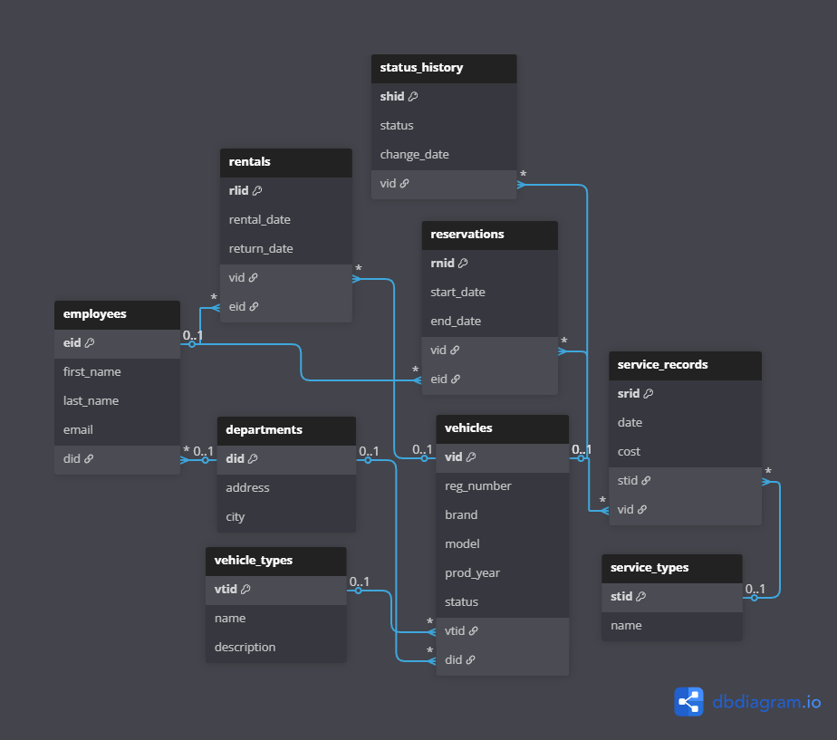

# Vehicle Fleet Management System - AGH Databases Project

Individual academic project implementing a relational database system for managing a company's vehicle fleet, including vehicle availability, reservations, rentals, service history and user roles.

## Project overview

The system allows a company to manage vehicle availability across departments, track rental history and record vehicle service events. 

The database also implements business rules that prevent conflicting reservations and rentals, including automatic validation using database triggers.

### Entity Relationship Diagram 



#### Setup virtual environment
```bash
python -m venv .venv
# Windows
.venv\Scripts\activate
pip install -r requirements.txt
```

#### Create docker container
```bash
docker compose up -d
```

#### Apply migrations
```bash
python app/cli.py migrate
```

#### Run scenarios as different system users
```bash
python app/cli.py run [scenario_1|scenario_2] [admin|jan.kowalski (optional)]
```

#### Connect to PostgreSQL database
```bash
docker exec -it {DB_CONTAINER} psql -U {DB_USER} -d {DB_NAME}
```

#### Stop and remove docker container and volumes
```bash
docker compose down -v
```
